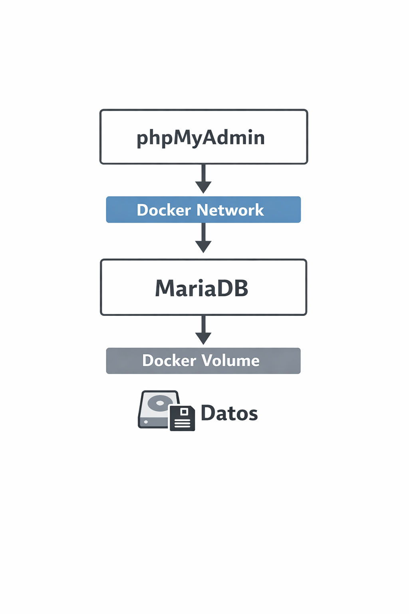

# 📦 Sección 3 — Persistencia de Datos, Volúmenes y Redes en Docker

Entramos a una de las **secciones más importantes de todo Docker**.

Hasta ahora hemos aprendido a:

✅ Crear contenedores
✅ Ejecutar bases de datos
✅ Conectarnos a ellas
✅ Eliminar contenedores

Pero descubrimos un problema serio.

---

# ⚠️ El Problema Actual

Hasta este momento:

- Creamos un contenedor PostgreSQL
- Insertamos datos
- Creamos tablas
- Trabajamos normalmente

Pero cuando hacemos:
```
docker container rm
```

👉 **Toda la información desaparece**.

---

## 🧠 ¿Por qué ocurre esto?

Porque:

> Los contenedores son temporales (*efímeros*).

Toda la información vive **dentro del contenedor**.

Si el contenedor muere → los datos mueren.

---

# 🎯 Objetivo de esta Sección

Aprenderemos a:

✅ Mantener datos aunque el contenedor se elimine
✅ Reconstruir contenedores sin perder información
✅ Compartir datos correctamente
✅ Conectar múltiples contenedores
✅ Crear redes Docker
✅ Usar herramientas externas como phpMyAdmin

---

# 💾 Solución: Volúmenes Docker

La idea es simple:
```
Contenedor → guarda datos → Volumen externo
```

En lugar de almacenar información dentro del contenedor:

👉 Docker la guarda en un **volumen independiente**.

---

## 📌 Resultado

Ahora podremos:

- eliminar contenedores ✅
- recrearlos ✅
- actualizar versiones ✅

Y aún así:
```
🔥 mantener toda la data intacta
```

---

# 🧱 Tipos de Volúmenes

Docker posee **3 tipos principales** (los veremos durante la sección):

1. **Named Volumes** ✅ (el más usado)
2. **Bind Mounts**
3. **Anonymous Volumes**

Comenzaremos con el más importante.

---

# 🔄 Nueva Mentalidad Docker

Antes:
```
Contenedor = Aplicación + Datos
```

Ahora:
```
Contenedor = Aplicación
Volumen = Datos
```

Separar ambos es una práctica profesional.

---

# 🌐 Segundo Problema: Comunicación entre Contenedores

Más adelante usaremos:

✅ Base de datos (MariaDB/MySQL)
✅ phpMyAdmin

Pero aparece otro reto:

> ¿Cómo se comunican dos contenedores?

---

## ❌ Sin red Docker

Los contenedores están aislados.

No pueden verse entre sí.

---

## ✅ Con red Docker

Crearemos una red donde:
```
phpMyAdmin ←→ Base de Datos
```

Docker proporcionará automáticamente:

- conexión interna
- resolución DNS
- comunicación segura

---

# 🧠 Parte Genial de Docker

No necesitas:

- conocimientos avanzados de networking
- configurar IPs manualmente
- editar DNS
- abrir puertos complejos

Docker hace todo automáticamente.

Incluso podrás usar:
```
nombre-del-contenedor
```

como si fuera un servidor real.

---

# 🧰 Herramienta que Usaremos

Trabajaremos con:

## phpMyAdmin

Un administrador visual muy popular para:

- MySQL
- MariaDB

Normalmente requeriría instalar:

- PHP
- Apache
- Configuración manual

Pero con Docker:
```
docker run ...
```

y listo ✅

---

# 🚀 Lo Que Lograremos al Final de la Sección

Tendrás algo similar a esto:



---

# 🔥 Mensaje Importante

Puede sonar complejo ahora…

Pero Docker convierte todo esto en comandos muy simples.

En las próximas clases verás que crear infraestructura completa puede tomar **menos de un minuto**.

---

# 🚀 Próximo Video

Comenzaremos con:

👉 **Qué es exactamente un volumen Docker**
👉 Cómo crearlo
👉 Cómo persistir datos reales 🐳

# Temas puntuales de la sección
Esta sección empieza a ponerse más interesante con los siguientes temas:

* Terminal interactiva dentro del contenedor
* Aplicaciones con múltiples contenedores
* Redes
* Volúmenes
* Mapeo de directorios y relaciones
* Montar un servidor Apache con PHPMyAdmin junto a MariaDB
* Revisar el file system de alpine y node

Esta sección empieza a dejar bases para el uso de los contenedores a otro nivel.

# 🧪 Tarea Práctica — Base de Datos World (MariaDB)

En esta clase realizaremos un **ejercicio de reforzamiento** usando todo lo aprendido hasta ahora sobre:

- Contenedores
- Imágenes
- Variables de entorno
- Puertos
- Conexiones a bases de datos

---

## 📂 Material Necesario

En el material adjunto encontrarás **dos archivos**:

1. ✅ **Instrucciones del ejercicio**
2. ✅ **Archivo SQL (`world.sql`)**

Este archivo SQL contiene:

- Creación de tablas
- Inserción de datos
- Relaciones entre tablas
- Información de países y lenguajes

⚠️ **No borres este archivo**, lo usaremos nuevamente más adelante.

---

## 🎯 Objetivo Final

Debes lograr:

✅ Levantar una base de datos MariaDB en Docker
✅ Conectarte **sin usar root**
✅ Ejecutar el script SQL
✅ Ver las tablas creadas correctamente

Tablas esperadas:

- `country`
- `countrylanguage`

Si puedes ver ambas → ✅ ejercicio correcto.

---

## 🐳 Paso 1 — Crear el Contenedor MariaDB

Debes montar la imagen:

```
mariadb:jammy
```

### Requisitos obligatorios

- Publicar el puerto:
```
3306 (host) → 3306 (contenedor)
```

- Nombre del contenedor:
```
world-db
```

---

## 🌎 Paso 2 — Variables de Entorno

Debes definir exactamente estas variables:

| Variable | Valor |
|-----------|------|
| MARIADB_USER | example-user |
| MARIADB_PASSWORD | user-password |
| MARIADB_ROOT_PASSWORD | root-password |
| MARIADB_DATABASE | world |

⚠️ Los nombres deben coincidir exactamente.

Docker crea automáticamente:

- usuario
- contraseña
- base de datos inicial

---

## 🔌 Paso 3 — Conectarse a la Base de Datos

Puedes usar:

- TablePlus ✅ (recomendado)
- DBeaver
- MySQL Workbench
- cualquier cliente SQL

### Configuración

Host:
```
localhost
```

Puerto:
```
3306
```

Usuario:
```
example-user
```

Password:
```
user-password
```

Base de datos:
```
world
```

🚫 **NO usar root**

---

## 🧾 Paso 4 — Ejecutar el Script SQL

1. Abrir editor SQL
2. Copiar TODO el contenido del archivo `world.sql`
3. Pegar en el editor
4. Seleccionar todo:
```
Ctrl + A
```

5. Ejecutar:
```
Ctrl + Enter
```

⏳ Esperar inserciones (puede tardar unos segundos).

---

## ✅ Paso 5 — Verificar Resultado

Recargar conexión:
```
Ctrl + R
```

Debes visualizar:

- tabla de países
- tabla de lenguajes
- relaciones entre datos

Si aparecen → ✅ éxito.

---

## ⚠️ Problema Detectado (Muy Importante)

Hasta ahora ocurre esto:

👉 Si eliminas el contenedor:
```
docker container rm -f ID
```

💥 **Toda la base de datos se pierde**

Porque:

- Los datos viven **dentro del contenedor**
- El contenedor es temporal

Esto significa que la base de datos es:

> 🔥 VOLÁTIL

---

## 🧠 Concepto Clave

Eliminar contenedor = eliminar datos.

Esto NO es aceptable en producción.

---

## 🚀 Próximo Tema

En la siguiente clase aprenderemos:

# 📦 Docker Volumes

Con ellos podremos:

✅ eliminar contenedores
✅ recrearlos
✅ mantener la información intacta

Persistencia real de datos 🔥

---

## 🧹 Limpieza Final

Eliminar el contenedor creado:
```
docker container ls
docker container rm -f ID
```

Cerrar conexiones abiertas del gestor SQL si aparece algún error.

---

✅ Fin del ejercicio
➡️ Continuamos con **Volúmenes en Docker**

# 📦 Docker Volumes — Persistencia de Datos

En esta clase comenzamos uno de los conceptos **más importantes de Docker**:

👉 **Los Volúmenes**

Hasta ahora vimos que:

❌ Si eliminamos un contenedor
❌ Perdemos toda la información

Ahora aprenderemos cómo **hacer persistente la data**.

---

# 🧠 Tipos de Volúmenes en Docker

En Docker existen **3 tipos de volúmenes**:

---

## 1️⃣ Named Volumes (Volúmenes con nombre)

Son los más utilizados ✅

Aquí **nosotros asignamos el nombre** del volumen.

Ejemplo conceptual:

- Docker crea un espacio persistente
- Nosotros decidimos cómo se llama
- Podemos reutilizarlo cuando queramos

👉 Ideal para bases de datos.

---

## 2️⃣ Anonymous Volumes (Volúmenes anónimos)

En este caso:

Docker genera automáticamente un nombre único.

Nosotros solo decimos:

> “Docker, crea un volumen”

Pero **no controlamos su nombre**.

📌 Uso común:
- pruebas rápidas
- contenedores temporales

---

## 3️⃣ Bind Volumes (Bind Mounts)

Sirven para conectar:

```
Carpeta REAL de tu computadora
↕
Carpeta dentro del contenedor
```

Muy usados en desarrollo porque permiten:

✅ editar archivos locales
✅ ver cambios en tiempo real
✅ simular entornos Linux sin instalar Linux

---

# ⭐ Comandos Principales de Volúmenes

Docker mantiene la misma lógica que ya conoces:

## Listar volúmenes
```
docker volume ls
```

## Crear volumen
```
docker volume create NOMBRE
```
## Eliminar volumen
```
docker volume rm NOMBRE
```
## Inspeccionar volumen
```
docker volume inspect NOMBRE
```


---

# 🏗️ Crear Nuestro Primer Volumen

Creamos un volumen persistente:
```
docker volume create world-db
```


Esto crea físicamente un espacio en tu computadora.

✅ Sobrevive a:
- eliminación de contenedores
- reinicios
- recreaciones

---

# 🔎 Ver Información del Volumen
```
docker volume inspect world-db
```

Docker mostrará:

- ubicación física
- fecha de creación
- configuración interna

---

# 🐳 Usar el Volumen con MariaDB

Tomamos el comando anterior donde creábamos MariaDB
y agregamos:
```
--volume world-db:/var/lib/mysql
```

---

## 📍 ¿Qué significa esto?
```
world-db → volumen en tu PC (HOST)
:/var/lib/mysql → carpeta dentro del contenedor
```

MariaDB guarda su información en:
```
/var/lib/mysql
```

(lo obtuvimos desde la documentación oficial).

Ahora Docker hará:
```
Base de datos → Volumen → Disco real
```

---

# 🧪 Proceso del Laboratorio

## 1️⃣ Levantar contenedor con volumen

Crear MariaDB usando el volumen.

---

## 2️⃣ Conectarse con TablePlus

Configurar:

Host:
```
localhost
```

Puerto:
```
3306
```

Usuario:
```
example-user
```

Password:
```
user-password
```
Base de datos:
```
world-db
```

---

## 3️⃣ Ejecutar nuevamente el script SQL

- Abrir editor SQL
- Pegar `world.sql`
- Ejecutar todo

Luego refrescar: `Ctrl + R`


✅ Ver tablas creadas.

---

# 📊 Ver el Volumen en Docker Desktop

Ir a:
```
Volumes
```
Verás algo como:
```
world-db
```

Con tamaño asignado.

⚠️ El tamaño incluye:
- datos
- índices
- metadata interna

---

# 🧨 PRUEBA IMPORTANTE (La Magia)

Ahora haz esto:

## ❌ Eliminar el contenedor
```
docker container rm -f ID
```

---

## ✅ Volver a crearlo con el MISMO comando

---

## 🔄 Refrescar TablePlus

Resultado esperado:

✅ TODA la información sigue ahí.

---

# 🎉 ¿Qué acabamos de lograr?

Ahora tenemos:

✅ Contenedores desechables
✅ Datos permanentes
✅ Persistencia real

Separación correcta:
```
Contenedor → temporal
Datos → permanentes
```

---

# 🧠 Concepto Profesional Clave

En Docker:

> ❗ Nunca guardes datos importantes dentro del contenedor
> ✅ Siempre usa Volumes

---

# 🚀 Próxima Clase

Continuaremos trabajando con:

- redes Docker
- comunicación entre contenedores
- phpMyAdmin + MariaDB

Ahora Docker empieza a sentirse **realmente profesional**.

# 🌐 Docker Networks — Conectando Contenedores

En esta clase comenzamos uno de los conceptos **más importantes cuando trabajamos con múltiples contenedores**:

👉 **Las redes en Docker (Docker Networks)**

---

# ✅ Estado Inicial Requerido

Antes de continuar debes tener:

✅ Contenedor **MariaDB corriendo**
✅ Volumen creado
✅ Base de datos con información cargada

Verifica con:
```
docker container ls
```

Debes ver algo similar a:

- `world-db` (MariaDB)
- volumen activo
- datos persistentes funcionando

⚠️ No borres el volumen todavía.

---

# 🧩 Objetivo de la Clase

Vamos a instalar:

👉 **phpMyAdmin**

Una herramienta web que permite:

- visualizar bases de datos
- ejecutar queries SQL
- administrar MariaDB/MySQL desde el navegador

---

# 🐘 ¿Qué es phpMyAdmin?

phpMyAdmin es:

✅ gratuito
✅ open source
✅ muy usado en hosting y cPanel
✅ interfaz web para MySQL/MariaDB

Normalmente necesitarías instalar:

- PHP
- Apache
- configuración web

Pero con Docker…

🔥 TODO ya viene listo dentro de la imagen.

---

# 📦 Imagen que Usaremos

Tag recomendado:
```
phpmyadmin:5.2.0-apache
```
Esto Incluye:
```
Apache + PHP + phpMyAdmin
```

preconfigurado.

---

# 🚀 Ejecutar phpMyAdmin

Ejemplo del contenedor:
```
docker container run
--name phpmyadmin
-d
-e PMA_ARBITRARY=1
-p 8080:80
phpmyadmin:5.2.0-apache
```

---

## 📘 Explicación del comando

### Nombre del contenedor
```
--name phpmyadmin
```

---

### Ejecutar en segundo plano
```
-d
```

---

### Variable de entorno
```
-e PMA_ARBITRARY=1
```

Permite conectarse manualmente a cualquier servidor de base de datos.

---

### Publicación de puertos
```
-p 8080:80
```

Significa:
```
Puerto PC → Puerto Contenedor
8080 → 80 (Apache)
```

---

# ✅ Verificar Contenedores
```
docker container ls
```

Debes tener:

- MariaDB ✅
- phpMyAdmin ✅

---

# 🌍 Abrir phpMyAdmin

En el navegador:
```
http://localhost:8080
```

Aparecerá la pantalla de login.

---

# ❌ Problema Importante (Y Esperado)

Intentamos conectarnos usando:
```
localhost
```
```
127.0.0.1
```

y…

🚨 **NO FUNCIONA**

---

# 🧠 ¿Por Qué No Funciona?

Porque existen **dos mundos diferentes**:

## 🖥️ Host (Tu computadora)
Aquí funciona TablePlus.

## 📦 Contenedor phpMyAdmin
Está aislado dentro de Docker.

---

Cuando phpMyAdmin intenta conectarse a:
```
localhost
```
realmente significa:
```
EL MISMO CONTENEDOR phpMyAdmin
```

NO tu MariaDB.

---

# 🔒 Regla de Oro de Docker Networking

> Dos contenedores SOLO pueden comunicarse
> si están dentro de la misma red Docker.

Si NO comparten red:

❌ no se ven
❌ no pueden conectarse
❌ no existe comunicación

---

# 🧱 Situación Actual

Actualmente tenemos:
```
phpMyAdmin ❌ MariaDB
(contenedor aislado)
```

Ambos existen…

pero **no están conectados**.

---

# 🌐 Solución Correcta

Crear una red Docker y colocar ambos contenedores dentro.

Conceptualmente:
```
phpMyAdmin
│
Docker Network
│
MariaDB
```

Docker automáticamente crea:

✅ DNS interno
✅ resolución por nombre
✅ comunicación segura

---

# 🚀 Lo Mejor de Todo

Dentro de la red podremos usar:
```
nombre-del-contenedor
```

como si fuera un servidor real.

Ejemplo futuro:

```
Servidor DB = world-db
```

Sin IPs.
Sin configuraciones complejas.
Sin networking avanzado.

---

# ⏭️ Próxima Clase

En la siguiente clase aprenderemos a:

✅ Crear nuestra primera red Docker
✅ Conectar contenedores
✅ Hacer que phpMyAdmin vea MariaDB
✅ Comunicación entre servicios

Aquí empieza el verdadero poder de Docker 🔥

# 🌐 Docker Networks — Creando y Conectando Contenedores

En esta clase aprenderemos **cómo resolver definitivamente la comunicación entre contenedores** usando redes en Docker.

---

## 📚 Lectura Opcional (Recomendada)

En el material adjunto encontrarás un enlace hacia la documentación oficial de **Docker Networks**.

👉 Es una lectura opcional, pero muy recomendable para:

- entender tipos de redes
- funcionamiento interno
- buenas prácticas
- comandos disponibles

💡 Regla profesional:
> Cuando tengas dudas sobre Docker → **Docker Docs es tu mejor amigo**.

---

# 🧠 Redes por Defecto en Docker

Podemos listar todas las redes existentes con:
```
docker network ls
```

Ejemplo de salida:

- `bridge`
- `host`
- `none`

---

## 🔹 Red `bridge`

Es la red **por defecto**.

👉 Si NO especificas una red al crear un contenedor:

Docker automáticamente lo conecta a `bridge`.

Sin embargo:

⚠️ Estar en `bridge` **NO garantiza comunicación automática entre contenedores** como necesitamos.

Por eso crearemos nuestra propia red.

---

# 🧰 Comandos Importantes de Networks

Docker mantiene la misma lógica que ya aprendimos:

| Acción | Comando |
|---|---|
| Listar redes | `docker network ls` |
| Crear red | `docker network create` |
| Conectar contenedor | `docker network connect` |
| Inspeccionar red | `docker network inspect` |
| Eliminar redes no usadas | `docker network prune` |

👉 Misma sintaxis que:
- containers
- images
- volumes

Docker es consistente 👍

---

# 🚀 Crear Nuestra Primera Red

Creamos una red personalizada:
```
docker network create world-app
```

Docker devolverá un **ID de red**.

Verificamos:
```
docker network ls
```

Ahora veremos:
```
world-app
```

✅ Red creada correctamente.

---

# 📦 Estado Actual

Tenemos dos contenedores corriendo:
```
docker container ls
```

- MariaDB ✅
- phpMyAdmin ✅

Pero…

❌ No pueden comunicarse
❌ Están aislados
❌ phpMyAdmin no ve la base de datos

---

# 🔗 Conectar Contenedores a la Red

Sintaxis:
```
docker network connect <red> <contenedor>
```

---

## Conectar phpMyAdmin
```
docker network connect world-app phpmyadmin
```

---

## Conectar MariaDB
```
docker network connect world-app world-db
```

---

# 🔍 Verificar Conexión

Podemos inspeccionar la red:
```
docker network inspect world-app
```

Ahora veremos ambos contenedores dentro de la misma red.

✅ phpMyAdmin
✅ MariaDB

---

# 🧠 Magia de Docker: DNS Automático

Docker crea automáticamente un **DNS interno**.

Esto significa que dentro de la red:

👉 Los contenedores pueden comunicarse usando **el nombre del contenedor**.

Ejemplo:
```
Servidor BD = world-db
```

NO necesitamos:

- IPs
- configuraciones manuales
- archivos hosts
- networking avanzado

---

# 🌍 Probar Conexión en phpMyAdmin

Abrimos:
```
http://localhost:8080
```

Ahora usamos:

| Campo | Valor |
|---|---|
| Server | `world-db` |
| User | `example_user` |
| Password | `user_password` |

✅ Conexión exitosa.

phpMyAdmin ahora puede hablar con MariaDB.

---

# 🎉 Resultado Final

Tenemos:

- Base de datos persistente
- Interfaz web funcionando
- Comunicación entre contenedores
- Red Docker personalizada

Arquitectura conceptual:
```
phpMyAdmin
│
world-app (Docker Network)
│
MariaDB
```

---

# 💡 Punto Importante

Hasta ahora hicimos:

1. Crear red
2. Crear contenedores
3. Conectarlos manualmente

Funciona ✅
Pero…

⚠️ Hay demasiados comandos.

En entornos reales **no se hace así manualmente**.

---

# ⏭️ Próxima Clase

Aprenderemos a:

✅ Crear contenedores ya conectados a una red
✅ Evitar pasos manuales
✅ Prepararnos para automatización
✅ Acercarnos a Docker Compose 🚀

# 🧩 Conectando Contenedores Directamente a una Red (Sin Pasos Manuales)

Hasta ahora ya aprendimos a:

✅ Crear contenedores
✅ Crear volúmenes
✅ Crear redes
✅ Conectar contenedores manualmente

Ahora veremos **una mejora importante**.

---

## 🧠 Recordatorio de los Dos Comandos Principales

### 🗄️ 1. Contenedor de MariaDB

Este comando:

- levanta la base de datos
- asigna volumen (persistencia)
- define variables de entorno
- asigna nombre al contenedor

Ese **nombre del contenedor** luego funciona como:

👉 DNS interno dentro de la red Docker.

---

### 🌐 2. Contenedor phpMyAdmin

Este segundo comando:

- levanta phpMyAdmin
- publica puertos
- define variables necesarias
- permite conectarnos visualmente a la base de datos

---

# 🧹 Primero: Limpieza Total

Antes de continuar eliminamos los contenedores actuales.

Ver contenedores activos: `docker container ls`

Eliminar todos (forzado): `docker container rm -f A7A B98`


*(usa los IDs de tus contenedores)*

---

## ✅ Verificación

Abrimos navegador:
```
http://localhost:8080
```

Ahora debería fallar ✅
Porque ya no hay nada corriendo.

---

## 📡 Verificar que la Red Sigue Existiendo
```
docker network ls
```

Debemos seguir viendo:
```
world-app
```

Si no existe:
```
docker network create world-app
```

---

# 🚀 Conectar Contenedores Desde el Inicio

Antes hacíamos:

1. Crear contenedor
2. Luego conectarlo a la red

Ahora lo haremos **en un solo paso**.

---

## ✅ Nueva Bandera Importante

Agregamos:
```
--network world-app
```

Esto conecta automáticamente el contenedor a la red.

---

## 🗄️ Levantar MariaDB en la Red

Ejecutamos el comando agregando:
```
--network world-app
```
Ejemplo conceptual:
```
docker container run
--name world-db
--network world-app
...
```

El contenedor ya nace dentro de la red ✅

---

## 🌐 Levantar phpMyAdmin en la Misma Red

Igual procedimiento:
```
docker container run
--name phpmyadmin
--network world-app
...
```

Ahora ambos contenedores:

✅ están conectados
✅ se descubren automáticamente
✅ pueden comunicarse

---

# 🌍 Probar Funcionamiento

Abrimos:
```
http://localhost:8080
```

Credenciales:

| Campo | Valor |
|---|---|
| Server | world-db |
| User | example_user |
| Password | user_password |

✅ Todo funciona correctamente.

---

# ⚠️ Problema Real Detectado

Imagina esto:

Creas múltiples phpMyAdmin:

- puerto 8080
- puerto 8081
- puerto 8082

Ahora tienes muchos contenedores…

❌ No sabes cuál pertenece a qué base de datos
❌ No hay relación visual
❌ Difícil mantenimiento

Docker Desktop tampoco muestra claramente la relación.

---

## 🧠 Conclusión Importante

Aunque Docker permite hacerlo manualmente…

👉 **NO es escalable**
👉 **NO es mantenible**
👉 **NO es profesional**

---

# 🚀 Aquí Aparece Docker Compose

En las próximas secciones aprenderemos:

✅ Crear redes automáticamente
✅ Crear volúmenes automáticamente
✅ Definir múltiples contenedores
✅ Agrupar servicios
✅ Levantar TODO con un solo comando

👉 Aplicaciones **Multi-Container** reales.

---

# 🧹 Tarea Final — Limpieza Completa

Realiza TODO usando terminal (NO Docker Desktop).

---

## 1️⃣ Eliminar Contenedores
```
docker container ls
```
Luego:
```
docker container rm -f ID1 ID2 ID3
```

---

## 2️⃣ Eliminar Volúmenes

Listar:
```
docker volume ls
```

Eliminar:
```
docker volume rm world-db
```

---

## 3️⃣ Eliminar Red

Listar redes:
```
docker network ls
```
docker network ls
```
docker network prune
```
Confirmar con: `y`

---

## ✅ Estado Final Esperado

- ❌ Sin contenedores
- ❌ Sin volúmenes
- ❌ Sin red personalizada
- ✅ Imágenes conservadas

---

🎯 Perfecto.

Ya terminaste **toda la base conceptual necesaria** para entrar a:

# 🐳 Docker Compose

# 🔗 Bind Volumes — Conectando tu Código Local con un Contenedor

En las próximas clases trabajaremos con **Bind Volumes**, uno de los conceptos más importantes de Docker cuando desarrollamos aplicaciones.

---

## 🧠 ¿Qué Problema Resuelven los Bind Volumes?

Imagina que tienes:

- tu aplicación en tu computadora (host)
- tu código fuente local
- pero necesitas ejecutarla en **Linux**

Esto es muy común cuando:

✅ funciona en Windows
✅ funciona en Mac
❌ falla en Linux

Y necesitas depurar el problema.

---

## ⚠️ Problema Tradicional

Antes normalmente había que:

- crear una máquina virtual Linux
- configurar autenticación
- instalar dependencias
- configurar base de datos
- replicar todo el entorno

👉 Mucho trabajo solo para hacer pequeños cambios.

---

## 🚀 Solución: Bind Volumes

Los **Bind Volumes** permiten conectar:

👉 El sistema de archivos de tu computadora
con
👉 El sistema de archivos dentro del contenedor

---

## 🧩 Concepto Visual

Tu computadora (Host):

```
/mi-proyecto
├── app.js
├── package.json
└── src/
```

⬇ conexión directa

Contenedor Docker (Linux):
```
/app
├── app.js
├── package.json
└── src/
```

Ambos apuntan **al mismo contenido**.

---

## ✅ Qué Logramos con Esto

### 1️⃣ Ejecutar Linux sin instalar Linux

El contenedor corre:

- Linux real
- dependencias reales
- entorno real

Sin máquinas virtuales pesadas.

---

### 2️⃣ Instalar dependencias dentro del contenedor

Ejemplo:
```
npm install
```

Las dependencias se instalan en Linux.

✔ compatibles con Linux
✔ visibles desde tu máquina host

---

### 3️⃣ Cambios en Tiempo Real

Si modificas un archivo en tu PC:
```
app.js
```

✅ el cambio aparece inmediatamente dentro del contenedor.

Y viceversa.

---

### 4️⃣ Acceso al Contenedor (Modo Interactivo)

Docker permite entrar al contenedor como si fuera una máquina real:
```
docker exec -it <contenedor> bash
```

Esto permite:

- revisar archivos
- ver logs
- analizar carpetas
- verificar variables de entorno
- depurar errores

👉 Literalmente **entras al Linux del contenedor**.

---

## 🛠️ Caso Real de Uso

Esto es extremadamente útil cuando:

- una app falla solo en Linux
- necesitas reproducir bugs
- quieres evitar máquinas virtuales
- debes probar entornos reales rápidamente

---

## ⚠️ Desventaja de Bind Volumes

No todo es perfecto.

Bind Volumes:

❌ consumen más recursos
❌ son un poco más lentos que ejecutar código localmente

Porque Docker sincroniza archivos constantemente.

---

## ✅ Cuándo Usarlos

Son ideales para:

- desarrollo local
- debugging
- pruebas rápidas
- mantenimiento de proyectos legacy
- entornos multiplataforma

---

## 🎯 Lo Que Haremos Después

En la siguiente clase vamos a:

✅ conectar código local al contenedor
✅ ejecutar una app dentro de Linux
✅ modificar archivos en vivo
✅ entrar al contenedor interactivo

Y verás uno de los **superpoderes reales de Docker** 🚀

# 🧪 Ejecutar una Aplicación Local dentro de un Contenedor Linux (Bind Volume)

En esta clase vamos a hacer algo **MUY importante en Docker**:

👉 Ejecutar una aplicación que está en tu computadora
👉 dentro de un **contenedor Linux**
👉 sin instalar nada localmente.

---

## 📦 Paso 1 — Preparar el Proyecto

1. Descarga el **archivo comprimido** del material adjunto.
2. Descomprímelo.
3. Crea una carpeta en tu **Escritorio** llamada:
```
Docker
```

4. Mueve la carpeta del proyecto dentro de `Docker`.

---

## 🧠 Importante

La aplicación está hecha en:

- Node.js
- TypeScript
- NestJS
- GraphQL

⚠️ **NO necesitas conocer estas tecnologías**
El objetivo es aprender Docker.

---

## 📂 Abrir el Proyecto

1. Abre **Visual Studio Code**
2. Arrastra la carpeta del proyecto dentro del editor.

Verás algo similar a:
```
src/
package.json
tsconfig.json
```

---

## 🧹 Eliminar Lock File

Borra el archivo:
```
yarn.lock
```

Esto permitirá que las dependencias se instalen nuevamente dentro del contenedor Linux.

---

## 🔎 Archivo a Revisar

Abre:
```
src/hello-world/hello-world.resolver.ts
```
Encontrarás algo como:
```
Hola Mundo
```

Ese texto aparecerá luego cuando ejecutemos la app.

---

## 🎯 Objetivo

Tenemos la aplicación en nuestro **filesystem local**, pero queremos:

✅ instalar dependencias
✅ ejecutar la app
✅ correr Node
✅ usar Linux

👉 TODO dentro de Docker.

---

## 📍 Paso 2 — Ir a la Carpeta del Proyecto

Abre una terminal (VS Code o sistema).

Navega hasta el proyecto:
```
cd Desktop/Docker/mi-proyecto
```

Verifica tu ubicación:

Mac / Linux:
```
pwd
```

Windows:
```
pwd
```

Debes estar dentro del proyecto.

---

## 🐳 Paso 3 — Elegir Imagen de Node

Ir a Docker Hub y buscar:
```
node
```

Usaremos la imagen oficial:
```
node:16-alpine3.16
```

Esto significa:

- Node v16
- Linux Alpine (ligero y seguro)

---

## 🚀 Paso 4 — Ejecutar Contenedor con Bind Volume

Creamos un comando largo (normal).

```bash
docker container run \
--name nest-app \
-w /app \
-p 1080:3000 \
-v "$(pwd)":/app \
node:16-alpine3.16 \
sh -c "yarn install && yarn start:dev"
```
## 🧩 Explicación del Comando
Nombre del contenedor
```
--name nest-app
```
Working Directory
```
-w /app
```
Equivale a ejecutar dentro del contenedor:
```
cd /app
```
Publicar Puerto
```
-p 1080:3000
```
|Host|Contenedor|
|----|----------|
|1080|3000|
-p 1080:3000
----
## 🔗 Bind Volume (LA MAGIA)
```
-v "$(pwd)":/app
```
Conecta:
```
Tu computadora → /app del contenedor
```
Todo cambio se sincroniza automáticamente.
----
## Imagen Docker
```
node:16-alpine3.16
```

----
## Comando al iniciar
```
sh -c "yarn install && yarn start:dev"
```
1. Instala dependencias
2. Ejecuta la aplicación
----
## ⚙️ Qué Pasará

Docker:

✅ descarga Node
✅ crea Linux
✅ instala dependencias
✅ genera node_modules
✅ levanta la app

Notarás que aparece:
```
node_modules/
```
en tu computadora.

👉 Fueron creados dentro del contenedor.
----
## 🌐 Paso 5 — Probar la Aplicación

Abrir navegador:
```
http://localhost:1080
```
Verás respuesta del servidor.

Luego entra a:
```
http://localhost:1080/graphql
```
Ejecuta:
```
{
  helloWorld
}
```
Resultado esperado:
```
Hola Mundo
```
🔥 Tu app corre en Linux sin instalar Node localmente.
----
## 🛑 Paso 6 — Detener Contenedor

Cancelar proceso:
```
CTRL + C
```
Luego:
```
docker container ls
docker container rm -f <ID>
```
-----
## ✅ Resultado Final

Aprendiste a:

* ejecutar apps locales en Docker
* usar Bind Volumes
* instalar dependencias en Linux
* sincronizar archivos host ↔ contenedor
* correr Node sin instalar Node
----
## ⚠️ NO borres el proyecto todavía
Lo usaremos en la siguiente clase.

# 🔁 Reejecutando la Aplicación con Bind Volumes (Hot Reload)

En esta clase vamos a comprobar algo **muy importante**:

✅ Docker ahora será mucho más rápido
✅ Las dependencias ya existen
✅ Los cambios locales se reflejan automáticamente
✅ Estamos desarrollando dentro de Linux sin instalar nada localmente

---

## 📌 Situación Actual

Ya tenemos:

- ✅ Proyecto descargado
- ✅ Dependencias instaladas dentro del contenedor
- ✅ Carpeta `node_modules`
- ✅ Carpeta `dist`
- ✅ Archivo `yarn.lock` generado automáticamente

Esto ocurrió porque anteriormente ejecutamos:

```bash
yarn install
```
dentro del **contenedor Linux**.

----
## RECAPITULANDO NO SE EN QUE PARTE ME QUEDE JDIEGO


# 🐳 Docker + Next.js — Desarrollo dentro del Contenedor

## 📌 Estado actual del proyecto

Actualmente tenemos la aplicación descargada.
Vamos a regresar a **Visual Studio Code** y volver a ejecutar el comando anterior.

Notaremos que ahora el proceso será **mucho más rápido**.

### ❓ ¿Por qué ocurre esto?

Porque las dependencias ya fueron instaladas previamente.

Estas dependencias:

- Son propias de **Linux**
- Docker ya las tiene disponibles
- El comando ya no necesita reinstalarlas

Por eso la ejecución ahora tarda mucho menos.

---

## 📁 Archivos generados

Durante la ejecución aparecieron nuevos elementos:

- La carpeta `dist`
  - Contiene el resultado final compilado de la aplicación Next.js.
- Archivo `package-lock.json`
  - Puede eliminarse.
  - Era parte del *warning* mostrado anteriormente.

---

## 🖥️ Volver a ejecutar la aplicación

Regresamos a la terminal.

Debemos asegurarnos de estar dentro de la carpeta del proyecto.

Ejemplo:

```
cd next-docker/next-graphql
```


También podemos usar la **terminal integrada de Visual Studio Code**, ya que automáticamente apunta a la carpeta correcta.

Ejecutamos nuevamente el comando del proyecto.

Ahora veremos:

- Inicio de compilación
- Modo observador activo (*watch mode*)
- Sin errores
- Sistema observando cambios

---

## 👀 Modo Observador (Watch Mode)

El **modo observador** significa que:

> Cada cambio realizado en el código recarga automáticamente la aplicación.

No es necesario reiniciar manualmente.

---

## 🌐 Verificación en el navegador

Abrimos:

```
http://localhost
```
Si aparece que no hay contenido, es una **buena señal**.

Luego ingresamos:
```
/graphql
```

---

## 🔎 Ejecutar Query GraphQL

Ejemplo de query:
```
query {
todos {
id
description
}
}
```

Respuesta esperada:
```
piedra desde el contenedor
```

Esto confirma que el contenedor está funcionando correctamente.

---

## ✏️ Probando Hot Reload

Vamos a modificar el código localmente.

Ruta:
```
source/hello/hello.resolver
```

Cambiar el texto por:
```
Hola mundo desde mi equipo
```

Guardar cambios.

---

### 🔄 Resultado

La terminal detectará automáticamente:

- Nuevo cambio
- Recompilación automática
- Aplicación recargada

Al ejecutar nuevamente la query:
```
Hola mundo desde mi equipo
```

✅ El cambio se refleja inmediatamente dentro del contenedor.

---

## 🧠 Importante

La aplicación está corriendo:

- Desde Docker
- Usando Node 16 dentro del contenedor
- Sin necesidad de una máquina virtual Linux manual

Aunque técnicamente Docker usa virtualización ligera.

---

## ✏️ Modificando datos dentro del servicio

Buscar:
```
todo.service
```

Cambiar el valor inicial:
```
piedra alma espacio tiempo poder realidad
```

Guardar cambios.

---

### 🔄 Comportamiento esperado

El navegador mostrará temporalmente un error porque:

- El contenedor se reinicia
- Luego vuelve a levantarse automáticamente

Ejecutamos nuevamente la query y veremos los nuevos valores.

---

## 🛑 Problema: Control + C no detiene el proceso

Si presionamos:
`CTRL + C`

Puede que el contenedor no se detenga correctamente.

Entonces abrimos una nueva terminal.

---

## 🧹 Eliminar contenedor manualmente

Listar contenedores:
```
docker container ls
```
Eliminar contenedor:
```
docker container rm -f <container_id>
```

Después ya no existirá comunicación con el contenedor.

---

## ▶️ Ejecutar nuevamente el proyecto

Entramos otra vez al proyecto:
```
cd docker-graphql
```

Ejecutamos nuevamente el comando de Docker.

Ahora el contenedor corre en **background**.

---

## 🐳 Revisar contenedor desde Docker Desktop

Podemos:

- Ver contenedores activos
- Revisar logs
- Confirmar compilación

---

## 📜 Ver logs desde terminal

Comando:

```
docker container logs -f <container_id>
```

Esto permite:

- Ver logs en tiempo real
- Cancelar fácilmente con `CTRL + C`
- Sin detener el contenedor

---

## ✅ Verificación final

Regresamos al navegador.

No es necesario recargar, solo ejecutar nuevamente la query.

Todo debería funcionar correctamente.

---

## 🎯 Lo aprendido en esta clase

✔ Modificaciones locales en el host
✔ Cambios reflejados automáticamente en Docker
✔ Uso del modo observador
✔ Manejo de contenedores
✔ Revisión de logs

---

## ⏭️ Próximo paso

En la siguiente clase se verá:

- Cómo entrar al contenedor usando una **terminal interactiva**
- Ejecutar comandos Shell dentro del contenedor
- Modificar código directamente desde Docker

Aunque no es la mejor experiencia, permite entender que tenemos acceso completo al entorno del contenedor.

# 🐳 Docker — Terminal Interactiva dentro del Contenedor

## 🎯 Objetivo de la clase

En esta clase vamos a:

- Entrar al **contenedor Docker**
- Usar una **terminal interactiva**
- Explorar el **filesystem del contenedor**
- Realizar modificaciones directamente dentro del Linux del contenedor

Recordemos:

> Un contenedor Docker está ejecutando un sistema **Linux**.

Vamos a entrar directamente a ese Linux.

---

## 🖥️ Mantener los logs corriendo

Dejamos ejecutándose el comando de logs:

```
docker container logs -f <container_id>
```

Esto permite observar los cambios en tiempo real.

Luego abrimos **una nueva terminal**.

---

## 📦 Listar contenedores activos

Ejecutamos:
```
docker container ls
```

Ejemplo de resultado:
```
CONTAINER ID IMAGE STATUS
3a5 app running
```

Necesitamos el **ID del contenedor**.

---

## 🚪 Entrar al contenedor (Terminal Interactiva)

Para ingresar usamos:
```
docker exec -it <container_id> /bin/sh
```

Ejemplo:
```
docker exec -it 3a5 /bin/sh
```

### ✅ ¿Qué significa?

- `exec` → ejecuta un comando dentro del contenedor
- `-it` → terminal interactiva
- `/bin/sh` → abre la shell de Linux

Ahora estamos **dentro del contenedor**.

---

## 🐧 Explorando el File System

Ver directorios:
```
ls
```

Veremos algo como:
```
app
bin
etc
usr
var
```

Esto corresponde al **filesystem del Linux interno** del contenedor.

---

## 📁 Explorando `/bin`

Entramos:
```
cd bin
ls
```

Aquí están los ejecutables instalados en el sistema.

Limpiar consola: `CTRL + L`


---

## 📂 Directorio de la Aplicación

Nuestra aplicación fue montada en:
```
/app
```

Entramos:
```
cd /app
ls
```

Contenido esperado:

- `src`
- `package.json`
- `tsconfig`
- `dist`
- `node_modules`

Esto es exactamente lo mismo que existe en nuestro host.

---

## 📂 Navegar al código fuente

```
cd src
ls
```

Luego:

```
cd hello
ls
```

Archivos importantes:
```
hello.resolver.ts
```

---

## 👀 Ver contenido de un archivo

Usamos:
```
cat hello.resolver.ts
```

El comando `cat`:

> Lee el archivo e imprime su contenido en la terminal.

---

## ✏️ Editar archivos dentro del contenedor

Usaremos el editor **vi**.
```
vi hello.resolver.ts
```

---

### 🧠 Controles básicos de VI

Entrar en modo edición:
```
i
```
Ahora podemos escribir o borrar texto.

Ejemplo:
```
desde mi contenedor
```

---

### 💾 Guardar y salir

1. Presionar `ESC`
2. Escribir:
```
:wq
```

Presionar `Enter`.

---

## ✅ Verificar cambios

Mostrar nuevamente el archivo:
```
cat hello.resolver.ts
```


Los cambios ya estarán aplicados.

---

## 🌐 Validar en el navegador

Ejecutar nuevamente el query GraphQL.

Resultado esperado:
```
Hola mundo desde mi contenedor
```

---

## 🔗 Sincronización Host ↔ Contenedor

Algo importante:

✅ El cambio fue hecho **dentro del contenedor**
✅ Automáticamente apareció en **Visual Studio Code**

Esto ocurre porque existen **volúmenes enlazados**.

---

## 🧪 Tarea práctica

Desde la terminal interactiva debes:

- Navegar hasta el servicio de todos
- Modificar el listado
- Eliminar o agregar registros

Usar comandos:
```
cd
ls
cat
vi
```

---

## ✅ Solución paso a paso

Entrar al directorio:
```
cd todos
ls
```

Editar archivo:

```
vi todo.service.ts
```

Entrar en modo edición:

```
i
```
Eliminar registros usando `Delete`.

---

Guardar cambios:
```
ESC
:wq
```

---

## 🌐 Verificar resultado

Regresar al navegador:
```
CTRL + ENTER
```

Los cambios deben reflejarse inmediatamente.

---

## ⚠️ Persistencia de cambios

Si existen volúmenes:

✅ Los cambios permanecen.

Si NO existen volúmenes:

❌ Los cambios se perderán al destruir el contenedor.

---

## 🎯 Lo aprendido

✔ Entrar a un contenedor
✔ Usar terminal interactiva
✔ Navegar filesystem Linux
✔ Editar archivos dentro del contenedor
✔ Sincronización host ↔ contenedor
✔ Uso básico de `vi`

---

## ⏭️ Próxima clase

Se verá:

- Aplicaciones con **múltiples contenedores**
- Manejo más sencillo de comandos
- Evitar ejecutar muchos comandos manualmente
- Limpieza de contenedores e imágenes

# 🐳 Docker — Salir de la Terminal Interactiva y Limpieza del Entorno

## 🚪 Salir de la Terminal Interactiva

Para salir de la terminal interactiva del contenedor simplemente ejecutar:

```
exit
```

Presionar `Enter` y regresaremos a nuestra terminal local.

---

## 🧹 Objetivo de la clase

Realizar una **limpieza completa del entorno Docker**.

Aunque no es un problema grave dejar contenedores o imágenes corriendo, es una buena práctica limpiar el entorno para evitar:

- Consumo innecesario de recursos
- Confusión entre proyectos
- Conflictos entre contenedores
- Acumulación de imágenes sin uso

---

## ⚠️ Sobre `docker prune`

Docker posee el comando:
```
docker system prune
```

Este comando elimina todo lo que no esté en uso.

✅ Útil
❌ Puede borrar recursos que usarás después

Por eso realizaremos una limpieza **manual y controlada**.

---

## 📦 Revisar Imágenes Docker

Listar imágenes instaladas:
```
docker image ls
```

### ✅ Mantener únicamente:
```
postgres:15.1
```

Si no la tienes instalada:
```
docker pull postgres:15.1
```

---

## ❌ Eliminar imágenes innecesarias

Eliminar imágenes como:

- phpMyAdmin
- Node
- MariaDB
- Versiones antiguas

Comando:
```
docker image rm <image_id>
```

Ejemplo:
```
docker image rm 675 58 B1F41F 8301604F1
```

Docker eliminará automáticamente sus **layers**.

---

## ⚠️ Error común al eliminar imágenes

Si aparece:
```
image is being used by running container
```

Significa que un contenedor está usando esa imagen.

---

## 🧱 Eliminar contenedores activos

Listar contenedores:
```
docker container ls
```

Eliminar contenedor forzadamente:
```
docker container rm -f <container_id>
```

Ejemplo:
```
docker container rm -f 3a5
```

Luego podremos eliminar la imagen sin problemas.

---

## 🌐 Limpiar redes Docker

Listar redes:
```
docker network ls
```
Eliminar redes manualmente o ejecutar:
```
docker network prune
```

Esto elimina todas las redes no utilizadas.

---

## ✅ Verificación final

Después de la limpieza deberíamos tener:

- ✅ Solo `postgres:15.1`
- ✅ Ningún contenedor activo
- ✅ Ninguna red innecesaria

---

## 🎯 Buenas prácticas aprendidas

✔ Salir correctamente de contenedores
✔ Identificar imágenes activas
✔ Eliminar contenedores dependientes
✔ Limpiar redes Docker
✔ Mantener entorno ordenado

---

## 🚀 Próxima sección

Comenzaremos a trabajar con:

- Aplicaciones de **múltiples contenedores**
- Manejo automático de redes
- Menos comandos manuales
- Mejor organización entre servicios

Esto evitará:

- Configuraciones tediosas
- Conexiones manuales entre contenedores
- Confusión cuando existan muchos servicios corriendo

----
## 💡 Tip real de Docker (nivel trabajo):

Muchos desarrolladores profesionales hacen limpieza rápida con:
```
docker container prune
docker image prune
docker network prune
```
pero **solo cuando saben exactamente qué pueden perder.**
----
